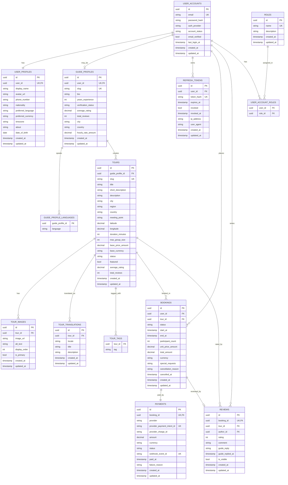

# MeetLocalGuide Database Schema (ERD Level)

## Scope

This schema covers the first production domain slice for:

- Auth and role management
- User and guide profiles
- Tours and tour localization
- Booking workflow
- Payments (Stripe-ready)
- Reviews

## ERD (Mermaid)

## Design Decisions

1. UUID primary keys:
Used for external exposure safety and easier horizontal scaling.

2. UserAccount separated from UserProfile and GuideProfile:
Auth/security concerns remain isolated from profile concerns, supporting clean architecture boundaries.

3. Booking as transactional pivot:
`bookings` links traveler and tour and becomes the source-of-truth for payment and review eligibility.

4. Payment decoupled but one-to-one with booking:
Supports Stripe payment intent/webhook lifecycle while keeping booking workflow independent of gateway internals.

5. Translation tables for i18n:
`tour_translations` enables EN/FR/AR localized content per tour without schema duplication.

6. Element collections for lightweight vocabularies:
`guide_profile_languages` and `tour_tags` keep flexible metadata normalized enough for filtering/search.

7. Explicit indexing for read-heavy paths:
Indexes target marketplace queries: tour listing filters, status filtering, guide lookup, booking timeline, and review reads.
